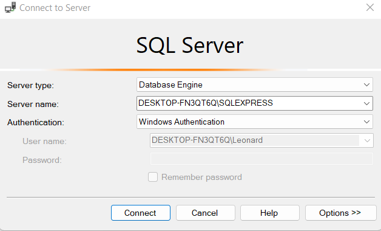
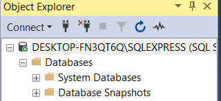
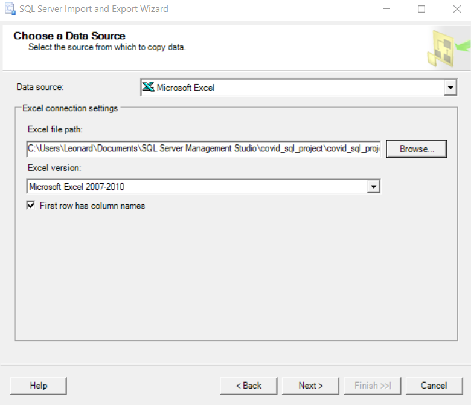
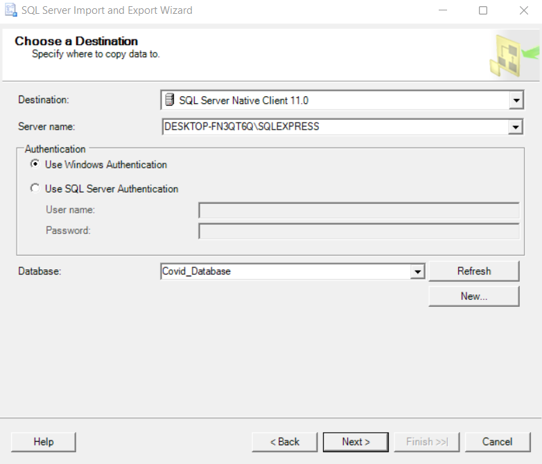
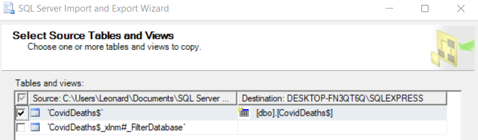

# SQL Covid Data Analysis

This is a simple SQL project to analyze Covid data and gain insightful conclusions. It also helps beginners that are looking to start their first SQL project as it teaches basic SQL technical concepts such as importing data and SQL coding.

## Getting started
Assuming you have not installed any SQL IDEs, I recommend using [SQL Server Management Studio (SSMS)](https://learn.microsoft.com/en-us/sql/ssms/download-sql-server-management-studio-ssms?view=sql-server-ver16) from Microsoft for this project.

In addition, install [SQL Express](https://www.microsoft.com/en-us/sql-server/sql-server-downloads) if you are using SSMS. This is because we need to connect to a server upon starting up SSMS. SQL Express will be used as our server & instance.
Once done, in the "Connect to Server" window in SSMS, type the following as the server name `<YOUR_COMPUTER_NAME>\SQLEXPRESS`:


If successful, you should see the following in the "Object Explorer" window in SSMS


## Import Project
If you are using SSMS, you can git clone this repo to your SSMS folder. The default location should be in `Documents/SQL Server Management Studio`.
```bash
git clone https://github.com/leonardlohky/covid_sql
```

## Importing Covid Data
First, create a new database in SSMS, to hold the Covid data, let's call it `Covid_Database`. To do this, right click on the "Databases" folder and select "New Database...". Rename the newly created database accordingly.

Next, we need to import the Covid Data (which is in Excel form found in the "data" folder of this repo). To import the data, run "SQL Server 2019 Import and Export Data" application.
1) Choose "Mircosoft Excel" as the data source type, and state the location of the Excel file


2) In the choose destination window, select "SQL Server Native Client 11.0" as teh destination, and "Covid_Database" as the database.


3) Choose the option to "Copy data from one or more tables or views"

4) Select the table to be copied over to the database in SSMS


5) After that, simply run the process and the data will be imported into the "Covid_Database" in SSSMS. Do this for both Excel files

## Acknowledgement
This project is done based on the tutorial by Alex the Analyst, his Youtube tutorial video can be found here:
https://www.youtube.com/watch?v=qfyynHBFOsM&t=886s